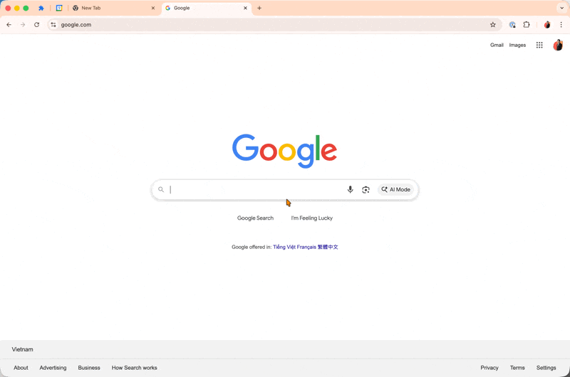

# Workspace Manager Releases

This folder contains all packaged releases of the Workspace Manager Chrome extension.

## Files

- **CHANGELOG.md** - Detailed changelog of all releases with features, fixes, and improvements
- **workspace-manager-vX.X.X.zip** - Packaged extension files ready for installation

## Installing a Release



1. Download the desired `.zip` file
2. Extract the contents to a folder
3. Open Chrome/Dia and go to `chrome://extensions/`
4. Enable "Developer mode" (toggle in top right)
5. Click "Load unpacked"
6. Select the extracted folder
7. The extension is now installed!

## Latest Release

**Version 2.1.0** - Adds ability to rename workspaces with inline editing

See [CHANGELOG.md](CHANGELOG.md) for full release history.

## Creating a New Release

Run the packaging script from the root directory:

```bash
./package-extension.sh
```

This will:
1. Read the version from `manifest.json`
2. Create a new zip file in the `releases/` folder
3. Prompt you to add a changelog entry (optional)
4. Automatically update `CHANGELOG.md` with your entry

## Changelog Format

When prompted, describe the changes in this format:

```
### New Features
- Feature 1 description
- Feature 2 description

### Bug Fixes
- Fix 1 description

### Improvements
- Improvement 1 description
```

The script will automatically add the version number and date.
